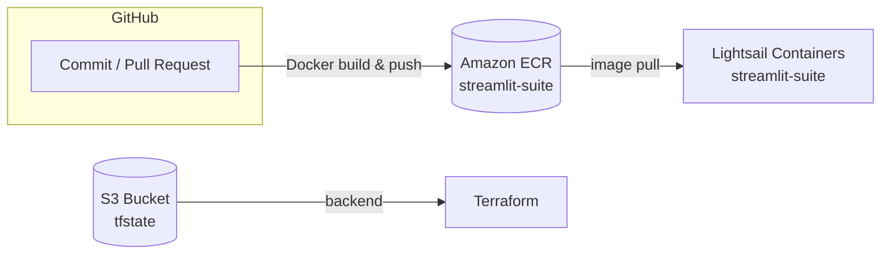

# Streamlit Suite インフラ構成 README

このリポジトリは **Streamlit／Shiny アプリを AWS Lightsail Containers で動かすための Infrastructure-as-Code**（Terraform + Makefile）を収録しています。
初めてデプロイする場合は、手順を詳しく解説した **[HOWTO.md](./HOWTO.md)** を先にご覧ください。

---

## 概要

| 項目 | 内容 |
|------|------|
| IaC | Terraform 1.11（S3 バックエンド + `use_lockfile=true`） |
| コンテナレジストリ | ECR `streamlit-suite`（タグ: `latest` と Git SHA） |
| 実行基盤 | AWS Lightsail Containers |
| CI/CD | GitHub Actions または `infra/Makefile` |

アプリの使い方は `apps/README.md` を参照してください。

---

## アーキテクチャ



---

## リポジトリ構成

```text
.
├── Dockerfile          # プロジェクトルート
├── src/                # Streamlit / Shiny アプリ本体
└── infra/              # ├── *.tf          … Terraform 設定
                        # └── Makefile      … デプロイ補助
```

---

## Make コマンド早見表

| コマンド | 目的 | 主な環境変数 |
|----------|------|-------------|
| `make build`   | Docker イメージをビルド（`latest` と `$(TAG)`） | `TAG` |
| `make push`    | ECR にイメージ 2 タグを push（`build`,`login` 自動実行） | `AWS_PROFILE`, `AWS_REGION` |
| `make plan`    | Terraform 変更差分を確認 (`terraform plan`) | `TAG` |
| `make apply`   | Plan を適用してデプロイ |  |
| `make deploy`  | **build → push → plan → apply** を一括実行 | 上記と同じ |
| `make destroy` | すべてのリソースを削除 |  |

デフォルト値（上書き可）:

```text
AWS_PROFILE = default
AWS_REGION  = ap-northeast-1
ECR_REPO    = streamlit-suite
TAG         = $(git rev-parse --short HEAD)
```

---

## Terraform 主要変数

| 変数 | 既定値 | 説明 |
|------|--------|------|
| `aws_profile` | `"default"` | ローカル実行時に使う AWS プロファイル |
| `image_tag` | `"latest"` | Lightsail が pull するイメージタグ |
| `openai_api_key` | なし（必須） | OpenAI API キー |

---
